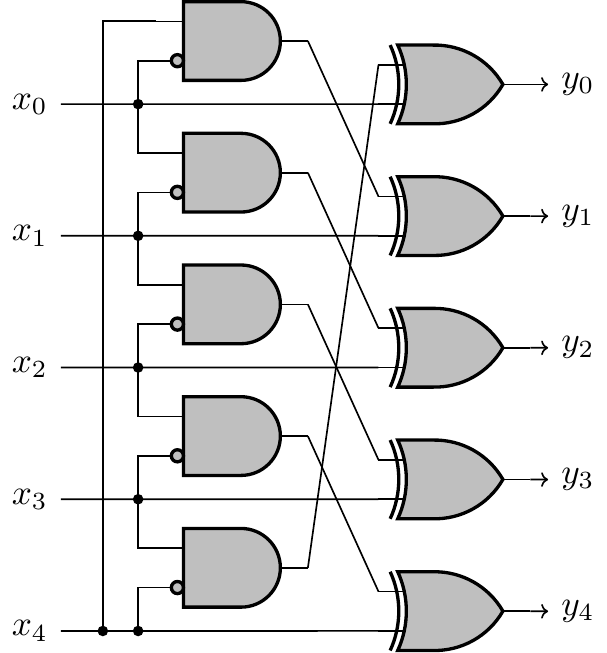
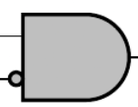
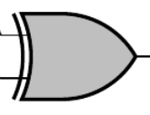

# Sample VHDL

This is an example VHDL project used in Daytona.

---

## 🚀 Getting Started  

### Open Using Daytona  

1. **Install Daytona**: Follow the [Daytona installation guide](https://www.daytona.io/docs/installation/installation/).  
2. **Create the Workspace**:  
   ```bash  
   daytona create https://github.com/daytonaio/sample-vhdl/
   ```
3. **Look at the circuit**



Architecture:


- 5 AND gates with one input inverted



and

- 5 XOR gatesd



Look at [circuit.vhd](circuit.vhd) VHDL code.

4. **File analysis**

   ```
   ghdl -a --std=08 circuit.vhd
   ```

Note: The `--std=08` parameter is passed in order to have access to the functions defined in the VHDL 2008 standard (to_string in particular)

5. **Development of the entity**:  
   ```bash  
   ghdl -e --std=08 circuit_test
   ```  

6. **Start the Application**:
   ```bash  
   ghdl -r --std=08 circuit_test
   ```
It should displays

```
circuit.vhd:71:9:@0ms:(report note): Time=0 fs ns IN x=UUUUU w=UUUUU OUT y=UUUUU
circuit.vhd:71:9:@0ms:(report note): Time=0 fs ns IN x=10000 w=UUUUU OUT y=UUUUU
circuit.vhd:71:9:@0ms:(report note): Time=0 fs ns IN x=10000 w=01000 OUT y=UUUUU
circuit.vhd:71:9:@0ms:(report note): Time=0 fs ns IN x=10000 w=01000 OUT y=10100
circuit.vhd:43:9:@10ns:(report note): Test 1 results:
circuit.vhd:44:9:@10ns:(report note): Input (x0,x1,x2,x3,x4) = 10000
circuit.vhd:45:9:@10ns:(report note): Output (y0,y1,y2,y3,y4) = 10100
circuit.vhd:53:13:@10ns:(report note): Test 1 passed: y = 10100
circuit.vhd:71:9:@10ns:(report note): Time=10000000 fs ns IN x=10011 w=01000 OUT y=10100
circuit.vhd:71:9:@10ns:(report note): Time=10000000 fs ns IN x=10011 w=01000 OUT y=10111
circuit.vhd:60:9:@20ns:(report note): Test 2 results:
circuit.vhd:61:9:@20ns:(report note): Input (x0,x1,x2,x3,x4) = 10011
circuit.vhd:62:9:@20ns:(report note): Output (y0,y1,y2,y3,y4) = 10111
circuit.vhd:63:9:@20ns:(report note): Test complete
```

---

## ✨ Features  

standardized development environment with devcontainers

console application
